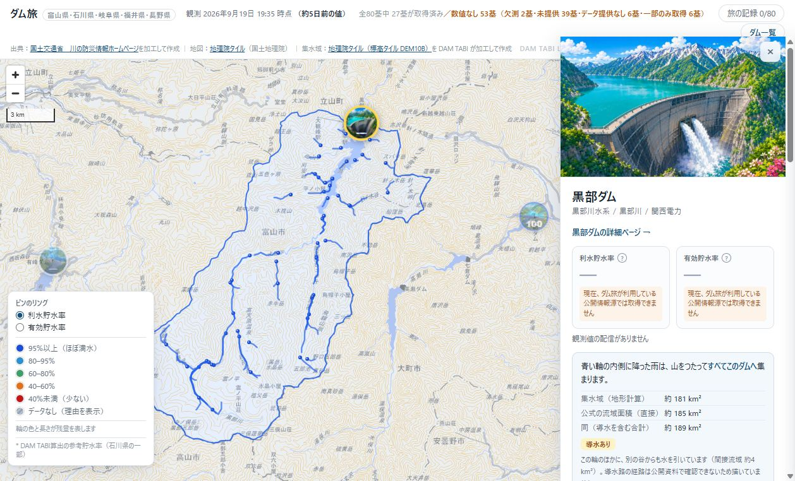
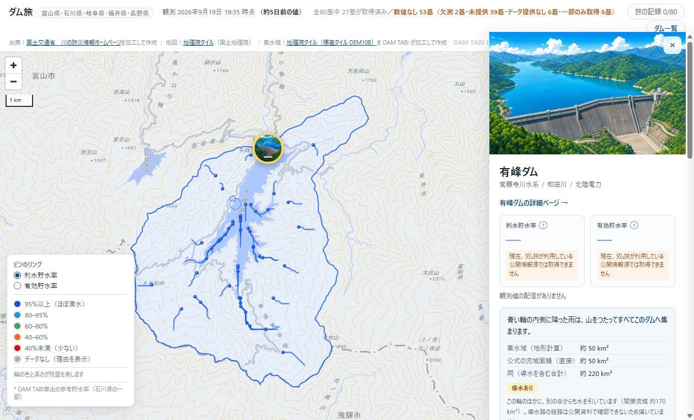
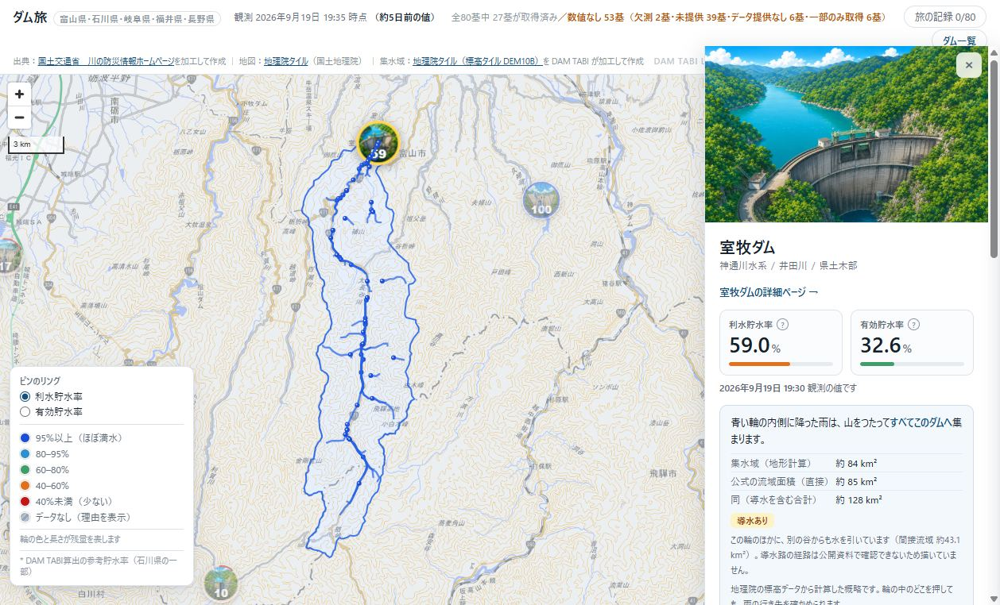

# 富山23基 集水域 個別審査資料（2026-09-24、d9763b6 時点）

> **この資料は公開承認ではない。** `data/watershed/release.json` の承認は0件、公開用の
> `docs/watershed/` は空のまま。承認の記入は人が1基ずつ行う。
>
> **「設定した追加確認条件に該当しない」（12基）は、この資料で置いた追加確認の条件（下の「振り分け」）に当たらなかった、という意味だけを持つ。** 集水域が正しいこと、公開してよいことを示すものではない。
>
> **堤体・取水口と採用出口の位置関係は、全基（23基）で独立資料による照合が未確認。**

## 読み方

- **画面の輪**: 画面の輪は、exact 方式で作った輪郭（画素の辺に沿ってたどり簡略化した多角形）を、表示時に smoothRing(ring, 2)（約30度より鋭い頂点を落としてから Chaikin を2回）で平滑化したもの。QA もこの平滑化後の輪で判定している。生の輪（平滑化前）は参考値のみ。
- **出口位置の独立した根拠**: 生成結果（採用出口・水面検出・出口周辺の面積プロファイル）は根拠に数えない。根拠に数えるのは生成と独立した資料だけ（ダム座標の出典、便覧、国土数値情報の河川名）。照合していない項目は「未確認」と書く。
- **便覧**: `dam_basin_spec.csv`。舟川・大谷は未確認のまま（補完していない）。
- **振り分け**: 「設定した追加確認条件に該当しない」＝次のどれにも当たらないもの: ダム座標の出典が未確認／便覧の直接流域が未確認／導水の有無が未確認／画面の面積表示が食い違う／出口の目安に当たる。目安（出口とダム座標の距離 500 m 超、出口候補を150→400mに広げたときの面積比 ×1.1 超）は審査の振り分け用で、QA の閾値ではない。QA の判定は変えていない。

## 全基に共通する課題（公開の前に解決が必要）

1. **スマホ幅で輪と雨が見えない（全21基）。** スマホ幅（390×844）では全21基で輪と雨が見えない。fitBounds の右余白に下部シートの幅（画面幅）を使っているため『Map cannot fit within canvas』で拡大されず（zoom 6.12 のまま）、輪は数ピクセルで下部シートの下に隠れる（表示率 0%）。説明文は読める。公開前にアプリ側の修正が必要（全基共通）。
2. **小さな集水域で面積の表示が食い違って見える。** 面積は整数 km² に丸めて表示する。小さな集水域（舟川 3.51 と参考 3.44 → 約4 / 約3、大谷 1.48 と参考 1.5 → 約1 / 約2）では、近い値なのに食い違って見える。他の19基は読み取りに問題なし。
3. **堤体・取水口と採用出口の位置関係は、全基で独立資料による照合が未確認。**

画面確認の方法: 隔離コピー（作業用フォルダ）で、リポジトリ外の模擬承認を使って 21 基を表示。127.0.0.1 のみで配信し、終了時に停止。リポジトリの docs/watershed/ と release.json は変更していない。

## 一覧

| ダム | 振り分け | 出口位置の独立した根拠 | 便覧との面積差 | 導水 | QA（平滑化した輪で判定） | 画面 PC / SP | 追加確認が必要な点 |
|---|---|---|---|---|---|---|---|
| 宇奈月ダム `toyama-unazuki` | **設定した追加確認条件に該当しない** | ダム座標は 川の防災情報 観測所マスタの座標と一致（ずれ 0 m）。堤体・取水口との照合は未確認 | 608.76 / 便覧 617.5 km²（-1.4%） | なし | pass IoU 0.9976／生の輪（参考）pass | PC OK／SP 輪 0% | — |
| 室牧ダム `toyama-muromaki` | **設定した追加確認条件に該当しない** | ダム座標は 川の防災情報 観測所マスタの座標と一致（ずれ 0 m）。堤体・取水口との照合は未確認 | 84.17 / 便覧 85.2 km²（-1.2%） | あり（間接 43.1 km²） | pass IoU 0.9952／生の輪（参考）pass | PC OK／SP 輪 0% | — |
| 熊野川ダム `toyama-kumanogawa` | **設定した追加確認条件に該当しない** | ダム座標は 川の防災情報 観測所マスタの座標と一致（ずれ 0 m）。堤体・取水口との照合は未確認 | 39.75 / 便覧 39.8 km²（-0.1%） | なし | pass IoU 0.9936／生の輪（参考）pass | PC OK／SP 輪 0% | — |
| 久婦須川ダム `toyama-kubusugawa` | **追加確認が必要** | ダム座標は 川の防災情報 観測所マスタの座標と一致（ずれ 0 m）。堤体・取水口との照合は未確認 | 59.01 / 便覧 58.7 km²（0.5%） | なし | exact は evaluate-only で pass（IoU 0.9929）。**状態の判定は旧 hold のまま**（rain_outside_ring・path_leaves_ring） | （候補でないため表示していない） | QA hold の解除は人の判断が必要（exact は evaluate-only で pass。候補を作っていない） 採用出口がダム座標から 503 m（小さな水面 0.14 km² から決めている） |
| 和田川ダム `toyama-wadagawa` | **追加確認が必要** | ダム座標は 川の防災情報 観測所マスタの座標と一致（ずれ 0 m）。堤体・取水口との照合は未確認 | 32.15 / 便覧 34.0 km²（-5.4%） | なし | pass IoU 0.9929／生の輪（参考）pass | PC OK／SP 輪 0% | 採用出口がダム座標から 1991 m（500 m 超） |
| 利賀川ダム `toyama-togagawa` | **設定した追加確認条件に該当しない** | ダム座標は 川の防災情報 観測所マスタの座標と一致（ずれ 0 m）。堤体・取水口との照合は未確認 | 38.54 / 便覧 38.0 km²（1.4%） | なし | pass IoU 0.9921／生の輪（参考）pass | PC OK／SP 輪 0% | — |
| 境川ダム `toyama-sakaigawa` | **追加確認が必要** | ダム座標は 川の防災情報 観測所マスタの座標と一致（ずれ 0 m）。堤体・取水口との照合は未確認 | 37.6 / 便覧 37.7 km²（-0.3%） | なし | pass IoU 0.9945／生の輪（参考）pass | PC OK／SP 輪 0% | 採用出口がダム座標から 770 m（500 m 超） |
| 刀利ダム `toyama-tori` | **追加確認が必要** | ダム座標は 川の防災情報 観測所マスタの座標と一致（ずれ 0 m）。堤体・取水口との照合は未確認 | 45.65 / 便覧 45.9 km²（-0.6%） | なし | pass IoU 0.9938／生の輪（参考）pass | PC OK／SP 輪 0% | 採用出口がダム座標から 504 m（500 m 超） 出口候補を 150→400m に広げると上流面積が ×760.833（出口の位置に敏感） |
| 五位ダム `toyama-goi` | **設定した追加確認条件に該当しない** | ダム座標は 川の防災情報 観測所マスタの座標と一致（ずれ 0 m）。堤体・取水口との照合は未確認 | 13.24 / 便覧 13.8 km²（-4.1%） | なし | pass IoU 0.9876／生の輪（参考）pass | PC OK／SP 輪 0% | — |
| 子撫川ダム `toyama-konadegawa` | **設定した追加確認条件に該当しない** | ダム座標は 川の防災情報 観測所マスタの座標と一致（ずれ 0 m）。堤体・取水口との照合は未確認 | 32.08 / 便覧 31.8 km²（0.9%） | なし | pass IoU 0.9932／生の輪（参考）pass | PC OK／SP 輪 0% | — |
| 城端ダム `toyama-johana` | **設定した追加確認条件に該当しない** | ダム座標は 川の防災情報 観測所マスタの座標と一致（ずれ 0 m）。堤体・取水口との照合は未確認 | 10.31 / 便覧 10.8 km²（-4.6%） | なし | pass IoU 0.9842／生の輪（参考）pass | PC OK／SP 輪 0% | — |
| 臼中ダム `toyama-usunaka` | **追加確認が必要** | ダム座標は 川の防災情報 観測所マスタの座標と一致（ずれ 0 m）。堤体・取水口との照合は未確認 | 13.12 / 便覧 13.5 km²（-2.8%） | なし | pass IoU 0.9893／生の輪（参考）pass | PC OK／SP 輪 0% | 出口候補を 150→400m に広げると上流面積が ×1.731（出口の位置に敏感） |
| 朝日小川ダム `toyama-asahiogawa` | **設定した追加確認条件に該当しない** | ダム座標は 川の防災情報 観測所マスタの座標と一致（ずれ 0 m）。堤体・取水口との照合は未確認 | 29.18 / 便覧 28.3 km²（3.1%） | なし | pass IoU 0.993／生の輪（参考）pass | PC OK／SP 輪 0% | — |
| 角川ダム `toyama-kadokawa` | **設定した追加確認条件に該当しない** | ダム座標は 川の防災情報 観測所マスタの座標と一致（ずれ 0 m）。堤体・取水口との照合は未確認 | 16.03 / 便覧 16.2 km²（-1.1%） | なし | pass IoU 0.9881／生の輪（参考）pass | PC OK／SP 輪 0% | — |
| 上市川ダム `toyama-kamiichigawa` | **設定した追加確認条件に該当しない** | ダム座標は 川の防災情報 観測所マスタの座標と一致（ずれ 0 m）。堤体・取水口との照合は未確認 | 45.91 / 便覧 44.7 km²（2.7%） | なし | pass IoU 0.993／生の輪（参考）pass | PC OK／SP 輪 0% | — |
| 上市川第二ダム `toyama-kamiichigawa-daini` | **設定した追加確認条件に該当しない** | ダム座標は 川の防災情報 観測所マスタの座標と一致（ずれ 0 m）。堤体・取水口との照合は未確認 | 39.57 / 便覧 38.7 km²（2.3%） | なし | pass IoU 0.9932／生の輪（参考）pass | PC OK／SP 輪 0% | — |
| 白岩川ダム `toyama-shiraiwagawa` | **HOLD（審査対象外）** | ダム座標は 川の防災情報 観測所マスタの座標と一致（ずれ 0 m）。堤体・取水口との照合は未確認 | 27.95 / 便覧 24.0 km²（16.4%） | なし | hold（manual_hold,area_error） IoU 0.9906／生の輪（参考）hold | （候補でないため表示していない） | HOLD 維持（人による保留：原因不明。exact でも面積誤差 +16.4% で ±15% を超える） |
| 舟川ダム `toyama-funagawa` | **追加確認が必要** | ダム座標は 川の防災情報 観測所マスタの座標と一致（ずれ 0 m）。堤体・取水口との照合は未確認 | 3.51 km² / 便覧 **未確認** | **未確認** | pass IoU 0.9778／生の輪（参考）pass | PC OK／SP 輪 0% | 便覧の直接流域が未確認（面積の照合ができない） 導水の有無が未確認（画面にも出ない） 画面の面積が整数に丸められ、算出 3.51 km² と参考 3.44 km² が「約 4」「約 3 km²」と食い違って見える（直後の注記は『近い値』と書いている） |
| 布施川ダム `toyama-fusegawa` | **設定した追加確認条件に該当しない** | ダム座標は 川の防災情報 観測所マスタの座標と一致（ずれ 0 m）。堤体・取水口との照合は未確認 | 13.21 / 便覧 13.0 km²（1.7%） | なし | pass IoU 0.9858／生の輪（参考）pass | PC OK／SP 輪 0% | — |
| 大谷ダム `toyama-otani` | **追加確認が必要** | ダム座標は 川の防災情報 観測所マスタの座標と一致（ずれ 0 m）。堤体・取水口との照合は未確認 | 1.48 km² / 便覧 **未確認** | **未確認** | pass IoU 0.9638／生の輪（参考）pass | PC OK／SP 輪 0% | 便覧の直接流域が未確認（面積の照合ができない） 導水の有無が未確認（画面にも出ない） 出口候補を 150→400m に広げると上流面積が ×1.189（出口の位置に敏感） 画面の面積が整数に丸められ、算出 1.48 km² と参考 1.5 km² が「約 1」「約 2 km²」と食い違って見える（直後の注記は『近い値』と書いている） |
| 黒部ダム `toyama-kurobe` | **追加確認が必要** | 観測所マスタなし。ダム座標の出典は記録されておらず未確認。堤体・取水口との照合は未確認 | 181.09 / 便覧 184.5 km²（-1.8%） | あり（間接 4.0 km²） | pass IoU 0.998／生の輪（参考）pass | PC OK／SP 輪 0% | ダム座標の出典が未確認（観測所マスタなし） |
| 有峰ダム `toyama-arimine` | **追加確認が必要** | 観測所マスタなし。ダム座標の出典は記録されておらず未確認。堤体・取水口との照合は未確認 | 50.44 / 便覧 49.9 km²（1.1%） | あり（間接 170.0 km²） | pass IoU 0.9971／生の輪（参考）pass | PC OK／SP 輪 0% | ダム座標の出典が未確認（観測所マスタなし） |
| 出し平ダム `toyama-dashidaira` | **追加確認が必要** | 観測所マスタなし。ダム座標の出典は記録されておらず未確認。堤体・取水口との照合は未確認 | 459.82 / 便覧 461.2 km²（-0.3%） | なし | pass IoU 0.9982／生の輪（参考）pass | PC OK／SP 輪 0% | ダム座標の出典が未確認（観測所マスタなし） |

## 重点確認: 黒部・有峰・室牧（導水あり）

### 黒部ダム

- 導水: 画面に「導水あり」と間接流域の注記を表示。間接流域 4.0 km²。輪は直接流域だけ。
- 境界の押下試験（PC・実際のマウス操作）: 輪の境界から格子1.5セル内側・外側の 16 点。内側 8/8 点がこのダムへ、外側 8/8 点がこのダム以外へ（外側の点の行き先: 出し平ダム）。描く輪（平滑化）と流向格子の判定は 16/16 点、描く輪と生の輪は 16/16 点で一致。
- 振り分け: **追加確認が必要**（ダム座標の出典が未確認（観測所マスタなし））

### 有峰ダム

- 導水: 画面に「導水あり」と間接流域の注記を表示。間接流域 170.0 km²。輪は直接流域だけ。
- 境界の押下試験（PC・実際のマウス操作）: 輪の境界から格子1.5セル内側・外側の 16 点。内側 8/8 点がこのダムへ、外側 8/8 点がこのダム以外へ。描く輪（平滑化）と流向格子の判定は 16/16 点、描く輪と生の輪は 16/16 点で一致。
- 振り分け: **追加確認が必要**（ダム座標の出典が未確認（観測所マスタなし））

- 地図上で輪の西外側に見える水域は「祐延ダム」の表示（別の貯水池）で、有峰湖の一部ではない。有峰湖の水面は輪の内側にある（`pc_arimine_west_crop.jpg`）。

### 室牧ダム

- 導水: 画面に「導水あり」と間接流域の注記を表示。間接流域 43.1 km²。輪は直接流域だけ。
- 境界の押下試験（PC・実際のマウス操作）: 輪の境界から格子1.5セル内側・外側の 16 点。内側 8/8 点がこのダムへ、外側 8/8 点がこのダム以外へ（外側の点の行き先: 利賀川ダム）。描く輪（平滑化）と流向格子の判定は 16/16 点、描く輪と生の輪は 16/16 点で一致。
- 振り分け: **設定した追加確認条件に該当しない**

## 別枠: 久婦須川（QA hold を維持。候補にしていない）

| 項目 | 旧（legacy の輪） | exact の輪（evaluate-only） |
|---|---|---|
| 判定 | hold（rain_outside_ring 3.12%・path_leaves_ring 3.54%） | pass（0.0%・0.0%） |
| 雨マスクが描く輪から2セル超外にある割合 | 描く輪 3.12%（8か所、最大 375 セル ≒ 1.4 km²）／生の輪 0.67% | 描く輪 0.00%／生の輪 0.00% |
| 格子（雨マスク・流向）の版 | 825a18c3dd73 | 825a18c3dd73（同一） |

- **旧 hold の原因は輪の作り方（legacy＝輪郭セルを角度順に並べる）で、集水域そのもの（格子）ではない。**雨マスクは1つにつながっており、面積は便覧 58.7 km² に対し 59.01 km²（+0.5%）。legacy の輪が集水域の一部を切り落とし、表示の平滑化でさらに広がっていた（生の輪 0.67% → 描く輪 3.12%）。exact の輪は雨マスクを全て含む。
- それでも残る点: QA hold の解除は人の判断が必要（exact は evaluate-only で pass。候補を作っていない）；採用出口がダム座標から 503 m（小さな水面 0.14 km² から決めている）。ダム座標は観測所マスタと一致（出口との位置関係は未確認）。
- hold の解除と候補化は人の判断。行う場合は `build_basins --outline exact --id toyama-kubusugawa` → `build_flowgrids --id` の実行が必要。

## 白岩川（HOLD 維持）

- 人による保留（原因不明）を維持。exact でも面積誤差 +16.4%（±15% 超）。候補にも審査対象にもしていない。

## 画面確認の結果（数値）

- PC 1280×860: 21基とも入口→輪・塗り・雨が出た。描いた輪の頂点数は Python の平滑化結果と全基で一致。輪は右パネルに隠れず全体が見える（100%）。コンソール警告なし。「導水あり」は室牧・黒部・有峰だけ、「ダム便覧に記載なし」は舟川・大谷だけ。
- SP 390×844: 21基とも説明文は読めるが、輪と雨は下部シートの下で見えない（表示率 0%、zoom 6.12、`Map cannot fit within canvas with the given bounds, padding, and/or offset.`）。
- 縮刷: `pc_all21.jpg`（PC）、`sp_all21.jpg`（SP）、`sp_kurobe_muromaki.jpg`。数値の詳細は `review.json`。

